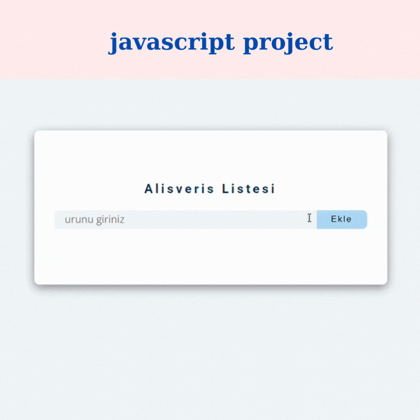

### Shopping List

This project is a shopping list application developed using HTML, CSS, and JavaScript. The application allows users to manage their shopping lists with functionalities to add, remove, and modify items.

### Features

- Add Items: Users can add new items to their shopping list.
- Remove Items: Users can remove items from their shopping list.
- Edit Items: Users can modify existing items in the list.
- Responsive Design: The application is designed to be responsive and work well on various devices.

## GIF

